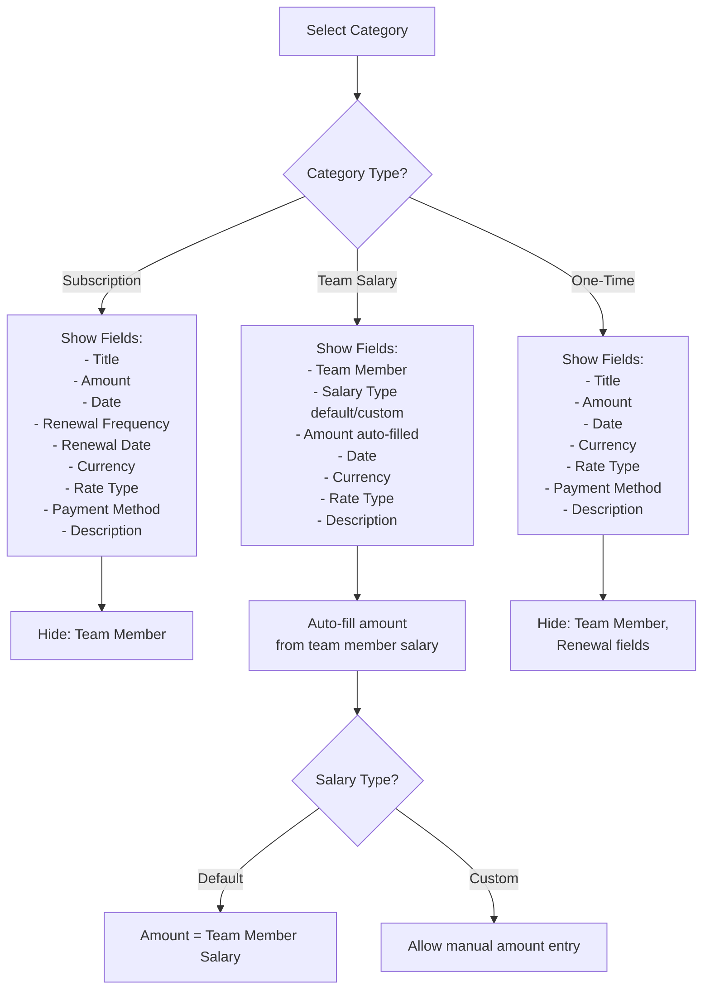

# Expense Model Refactor Plan

## Overview

Restructure the expense system to support four distinct expense types with conditional form fields, implement standalone loan tracking, reorganize UI tabs with visual separation, and add comprehensive internationalization support.

## Current Structure Analysis

**Existing Models:**

- `Expense` - Base expense model with subscription and loan relations
- `Subscription` - Links to Expense via `expenseId`
- `TeamMemberLoan` - Links to Expense via `expenseId` 
- `LoanPayment` - Tracks payments for loans
- `ExpenseCategory` - Categories like "Subscription", "Team Salary", "One-time", "Loan"

**Current Issues:**

- Loans are tied to expenses (needs decoupling)
- No conditional form fields based on expense type
- Missing translations in several places
- No visual separation between expense and people tabs
- Currency conversion display not showing both amounts

## Architecture Changes

### 1. Database Schema Modifications

**Create new standalone Loan model** (`packages/database/prisma/schema.prisma`):

```prisma
model Loan {
  id              String        @id @default(cuid())
  teamMemberId    String
  teamMember      TeamMember    @relation(fields: [teamMemberId], references: [id], onDelete: Cascade)
  businessId      String
  expenseAccount  ExpenseAccount @relation(fields: [businessId], references: [id], onDelete: Cascade)
  principalAmount Decimal
  currentBalance  Decimal       // Outstanding amount
  currency        String        @default("USD")
  conversionRate  Decimal?
  loanDate        DateTime
  notes           String?
  status          String        @default("active") // active, paid, cancelled
  payments        LoanPayment[]
  createdBy       String
  creator         User          @relation(fields: [createdBy], references: [id], onDelete: Restrict)
  createdAt       DateTime      @default(now())
  updatedAt       DateTime      @updatedAt

  @@index([teamMemberId])
  @@index([businessId])
  @@index([status])
  @@map("loan")
}
```

**Update LoanPayment** to reference new Loan model:

```prisma
model LoanPayment {
  id           String   @id @default(cuid())
  loanId       String
  loan         Loan     @relation(fields: [loanId], references: [id], onDelete: Cascade)
  amount       Decimal
  currency     String   @default("USD")
  conversionRate Decimal?
  paymentDate  DateTime
  paymentType  String   // "payment" or "disbursement"
  notes        String?
  recordedBy   String
  recorder     User     @relation(fields: [recordedBy], references: [id], onDelete: Restrict)
  createdAt    DateTime @default(now())

  @@index([loanId])
  @@map("loanPayment")
}
```

**Update TeamMember** to include loan balance:

```prisma
model TeamMember {
  // ... existing fields
  loans           Loan[]              // NEW: Direct relation to loans
  totalLoanBalance Decimal  @default(0) // NEW: Cached total outstanding
  // ... rest of fields
}
```

**Migration Strategy:**

1. Create new `Loan` model
2. Migrate existing `TeamMemberLoan` data to new `Loan` model
3. Update `LoanPayment` foreign keys
4. Keep old `TeamMemberLoan` model for backward compatibility during migration
5. Eventually deprecate `TeamMemberLoan` and `Expense.loan` relation

### 2. Tab Structure Reorganization

**New Tab Layout** in [`apps/web/modules/saas/expenses/components/BusinessDashboard.tsx`](apps/web/modules/saas/expenses/components/BusinessDashboard.tsx):

```
Expenses | Subscriptions | One-Time  [DIVIDER]  Team Members | Loans
```

**Tab Behaviors:**

- **Expenses Tab**: Shows ALL expense types (Subscriptions + One-Time + Team Salaries) combined
- **Subscriptions Tab**: Filtered view of subscription expenses only
- **One-Time Tab**: Filtered view of one-time expenses only  
- **Team Members Tab**: Team member management + their salary history
- **Loans Tab**: Standalone loan tracking (give loans / record payments)

**Visual Divider Implementation:**

```tsx
<TabsList>
  <TabsTrigger value="expenses">Expenses</TabsTrigger>
  <TabsTrigger value="subscriptions">Subscriptions</TabsTrigger>
  <TabsTrigger value="one-time">One-Time</TabsTrigger>
  <div className="h-6 w-px bg-border mx-2" /> {/* Visual divider */}
  <TabsTrigger value="team">Team Members</TabsTrigger>
  <TabsTrigger value="loans">Loans</TabsTrigger>
</TabsList>
```

### 3. Conditional Form Fields

**Update CreateExpenseDialog** ([`apps/web/modules/saas/expenses/components/CreateExpenseDialog.tsx`](apps/web/modules/saas/expenses/components/CreateExpenseDialog.tsx)):

**Form Schema:**

```typescript
const formSchema = z.object({
  categoryId: z.string().min(1), // Determines which fields show
  title: z.string().min(1).max(255),
  
  // Conditional: Subscription
  renewalFrequency: z.enum(["monthly", "yearly"]).optional(),
  renewalDate: z.coerce.date().optional(),
  provider: z.string().optional(),
  
  // Conditional: Team Salary
  teamMemberId: z.string().optional(),
  salaryType: z.enum(["default", "custom"]).optional(),
  
  // Common fields
  amount: z.number().positive(),
  date: z.coerce.date(),
  currency: z.string().default("USD"),
  rateType: z.enum(["default", "custom"]).default("default"),
  customRate: z.number().positive().optional(),
  paymentMethodId: z.string().optional(),
  description: z.string().optional(),
}).superRefine((data, ctx) => {
  // Validation based on category
  const category = categories?.find(c => c.id === data.categoryId);
  
  if (category?.name === "Subscription") {
    if (!data.renewalFrequency || !data.renewalDate) {
      ctx.addIssue({
        code: z.ZodIssueCode.custom,
        message: "Renewal details required for subscriptions",
        path: ["renewalFrequency"],
      });
    }
  }
  
  if (category?.name === "Team Salary") {
    if (!data.teamMemberId) {
      ctx.addIssue({
        code: z.ZodIssueCode.custom,
        message: "Team member required for salary expense",
        path: ["teamMemberId"],
      });
    }
  }
});
```

**Conditional Field Display Logic:**



**Field Visibility Rules:**

| Field | Subscription | Team Salary | One-Time |

|-------|-------------|-------------|----------|

| Title | ✅ | ✅ (optional) | ✅ |

| Category | ✅ | ✅ | ✅ |

| Team Member | ❌ | ✅ Required | ❌ |

| Salary Type | ❌ | ✅ | ❌ |

| Amount | ✅ | ✅ Auto-filled | ✅ |

| Date | ✅ | ✅ | ✅ |

| Renewal Frequency | ✅ | ❌ | ❌ |

| Renewal Date | ✅ | ❌ | ❌ |

| Provider | ✅ | ❌ | ❌ |

| Currency | ✅ | ✅ | ✅ |

| Rate Type | ✅ | ✅ | ✅ |

| Payment Method | ✅ | ✅ | ✅ |

| Description | ✅ | ✅ | ✅ |

### 4. Currency Conversion Display

**Implementation in Amount Field:**

When user selects a currency different from expense account currency, show converted amount:

```tsx
// Example: Expense account is in BDT (rate: 120)
// User enters 20 USD

<FormField
  control={form.control}
  name="amount"
  render={({ field }) => (
    <FormItem>
      <FormLabel>
        Amount
        {selectedCurrency !== accountCurrency && conversionRate && (
          <span className="text-muted-foreground text-sm ml-2">
            ({formatCurrency(
              field.value * conversionRate,
              accountCurrency
            )} {accountCurrency})
          </span>
        )}
      </FormLabel>
      <FormControl>
        <Input
          type="number"
          step="0.01"
          {...field}
          onChange={(e) => field.onChange(Number(e.target.value))}
        />
      </FormControl>
    </FormItem>
  )}
/>

// Result display: "Amount: 20 (2,400 BDT)"
```

**Storage:**

- Primary amount: User-entered amount in selected currency
- Metadata stores: Original currency, conversion rate used, converted amount
- Reports can show either or both based on context

### 5. Loan Management System

**New CreateLoanDialog** ([`apps/web/modules/saas/expenses/components/CreateLoanDialog.tsx`](apps/web/modules/saas/expenses/components/CreateLoanDialog.tsx)):

```tsx
const formSchema = z.object({
  teamMemberId: z.string().min(1),
  amount: z.number().positive(),
  currency: z.string().default("USD"),
  rateType: z.enum(["default", "custom"]).default("default"),
  customRate: z.number().positive().optional(),
  loanDate: z.coerce.date(),
  notes: z.string().optional(),
});

// Features:
// - Select team member
// - Enter loan amount
// - Currency conversion (same as expenses)
// - Automatic balance tracking
```

**New RecordLoanPaymentDialog** ([`apps/web/modules/saas/expenses/components/RecordLoanPaymentDialog.tsx`](apps/web/modules/saas/expenses/components/RecordLoanPaymentDialog.tsx)):

```tsx
const formSchema = z.object({
  loanId: z.string().min(1),
  amount: z.number().positive(),
  currency: z.string().default("USD"),
  paymentDate: z.coerce.date(),
  notes: z.string().optional(),
});

// Features:
// - Shows current loan balance
// - Enter payment amount
// - Validates payment doesn't exceed balance
// - Auto-updates team member total loan balance
// - Marks loan as "paid" when balance reaches 0
```

**LoanList Component Updates** ([`apps/web/modules/saas/expenses/components/LoanList.tsx`](apps/web/modules/saas/expenses/components/LoanList.tsx)):

```tsx
// Show loans with actions:
// - View payment history
// - Record payment
// - Edit loan details
// - Cancel loan (sets status to cancelled, doesn't delete)

// Display columns:
// - Team Member
// - Principal Amount
// - Current Balance  
// - Loan Date
// - Status
// - Actions (Record Payment, View History, More)
```

### 6. Translation Keys

**Add missing translations** to [`packages/i18n/translations/en.json`](packages/i18n/translations/en.json):

```json
{
  "expenses": {
    "create": "Create Expense",
    "createSubscription": "Create Subscription",
    "createTeamSalary": "Create Team Salary",
    "createOneTime": "Create One-Time Expense",
    
    "form": {
      "categoryType": "Expense Type",
      "renewalFrequency": "Renewal Frequency",
      "renewalDate": "Renewal Date",
      "provider": "Provider",
      "salaryType": "Salary Type",
      "salaryTypeDefault": "Default Salary",
      "salaryTypeCustom": "Custom Amount",
      "amountHint": "Amount in {currency}",
      "convertedAmount": "({amount} {currency})",
      "teamMemberSalary": "Team member's current salary: {amount}"
    },
    
    "tabs": {
      "expenses": "Expenses",
      "subscriptions": "Subscriptions",
      "oneTime": "One-Time",
      "teamMembers": "Team Members",
      "loans": "Loans"
    },
    
    "oneTime": {
      "title": "One-Time Expenses",
      "empty": "No one-time expenses found"
    }
  },
  
  "loans": {
    "create": "Give Loan",
    "recordPayment": "Record Payment",
    "viewHistory": "View Payment History",
    "currentBalance": "Current Balance",
    "principalAmount": "Principal Amount",
    "totalOutstanding": "Total Outstanding",
    "paymentHistory": "Payment History",
    
    "form": {
      "selectTeamMember": "Select team member",
      "loanAmount": "Loan Amount",
      "paymentAmount": "Payment Amount",
      "loanDate": "Loan Date",
      "paymentDate": "Payment Date",
      "remainingBalance": "Remaining Balance: {amount}"
    },
    
    "status": {
      "active": "Active",
      "paid": "Paid",
      "cancelled": "Cancelled"
    },
    
    "messages": {
      "created": "Loan recorded successfully",
      "paymentRecorded": "Payment recorded successfully",
      "paidInFull": "Loan has been paid in full",
      "paymentExceedsBalance": "Payment amount cannot exceed current balance"
    }
  },
  
  "teamMembers": {
    "loanBalance": "Loan Balance",
    "noLoans": "No outstanding loans"
  }
}
```

### 7. API Procedures

**New Loan Procedures** in `packages/api/modules/expenses/loans/`:

1. `create-loan.ts` - Create new loan (not expense)
2. `record-loan-payment.ts` - Record payment against loan
3. `list-loans.ts` - List loans with filters
4. `get-loan-details.ts` - Get loan with payment history
5. `update-loan.ts` - Update loan details
6. `cancel-loan.ts` - Cancel loan

**Update Expense Procedures:**

1. `create-expense.ts` - Handle conditional fields based on category
2. `list-expenses.ts` - Add filtering by expense type (subscription/one-time/team-salary)

## Implementation Steps

### Phase 1: Database Migration (SQL files)

1. Create migration for new `Loan` model
2. Create migration to add `totalLoanBalance` to `TeamMember`
3. Data migration script to move existing `TeamMemberLoan` to `Loan`
4. Update `LoanPayment` foreign keys

### Phase 2: Backend API

1. Create new loan procedures (create, payment, list, details)
2. Update expense creation procedure with conditional logic
3. Add loan balance update triggers
4. Update team member queries to include loan balance

### Phase 3: UI Components  

1. Update `BusinessDashboard` tabs with divider
2. Create `OneTimeExpenseList` component
3. Refactor `CreateExpenseDialog` with conditional fields
4. Create `CreateLoanDialog` component
5. Create `RecordLoanPaymentDialog` component
6. Update `LoanList` component for standalone loans
7. Update `TeamMemberList` to show loan balance

### Phase 4: Translations

1. Add all missing translation keys
2. Update components to use translations
3. Test with different locales

### Phase 5: Testing & Polish

1. Test all expense type creations
2. Test loan creation and payment flow
3. Test currency conversions
4. Verify reports work with new structure
5. Update documentation

## Key Files to Modify

**Database:**

- [`packages/database/prisma/schema.prisma`](packages/database/prisma/schema.prisma)
- New migration files in `packages/database/prisma/migrations/`

**API:**

- [`packages/api/modules/expenses/procedures/create-expense.ts`](packages/api/modules/expenses/procedures/create-expense.ts)
- New files in `packages/api/modules/expenses/loans/procedures/`
- [`packages/api/modules/expenses/loans/router.ts`](packages/api/modules/expenses/loans/router.ts)

**UI Components:**

- [`apps/web/modules/saas/expenses/components/BusinessDashboard.tsx`](apps/web/modules/saas/expenses/components/BusinessDashboard.tsx)
- [`apps/web/modules/saas/expenses/components/CreateExpenseDialog.tsx`](apps/web/modules/saas/expenses/components/CreateExpenseDialog.tsx)
- New: `apps/web/modules/saas/expenses/components/CreateLoanDialog.tsx`
- New: `apps/web/modules/saas/expenses/components/RecordLoanPaymentDialog.tsx`
- New: `apps/web/modules/saas/expenses/components/OneTimeExpenseList.tsx`
- [`apps/web/modules/saas/expenses/components/LoanList.tsx`](apps/web/modules/saas/expenses/components/LoanList.tsx)
- [`apps/web/modules/saas/expenses/components/TeamMemberList.tsx`](apps/web/modules/saas/expenses/components/TeamMemberList.tsx)

**Translations:**

- [`packages/i18n/translations/en.json`](packages/i18n/translations/en.json)

## Notes

- This is a significant refactor that changes core data models
- Migration will preserve existing data
- Old `TeamMemberLoan` model kept for compatibility
- Currency conversion logic reusable across all dialogs
- Loan system now completely independent of expenses
- Reports will need updates to handle new loan structure