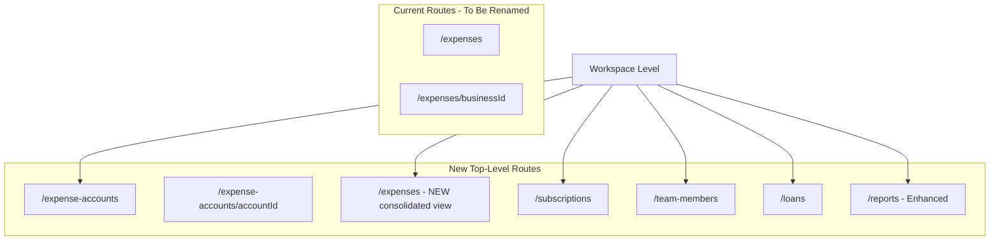
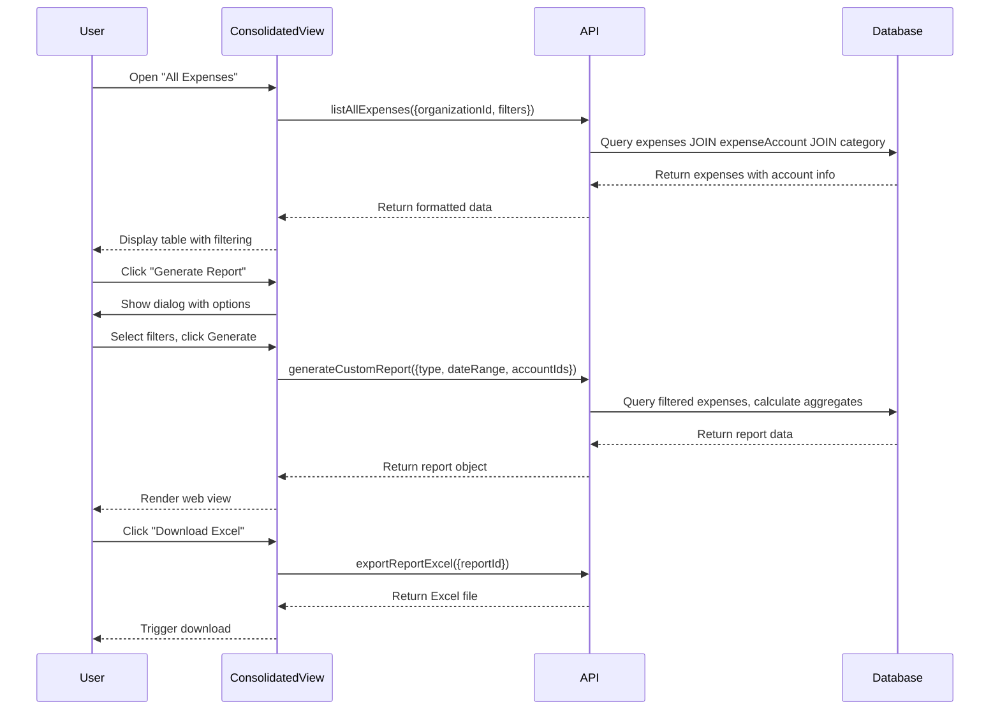

# Expense Tracking System Restructure

## Current State Analysis

The system currently has:

- Route: `[organizationSlug]/expenses` - Shows list of expense accounts (BusinessList)
- Route: `[organizationSlug]/expenses/[businessId]` - Shows individual expense account dashboard with tabs for expenses, subscriptions, team members, loans
- Database: Tables renamed from "business" to "expenseAccount" (completed)
- Categories: Subscription, Team Salary, One-time, Team Member Loan

## Architecture Overview



## Phase 1: Route Restructuring

### 1.1 Rename Expenses to Expense Accounts

**File Moves:**

- Move `app/(saas)/[organizationSlug]/expenses/` → `app/(saas)/[organizationSlug]/expense-accounts/`
- Update all internal routes and links

**Components to Update:**

- [`apps/web/modules/saas/expenses/components/BusinessList.tsx`](apps/web/modules/saas/expenses/components/BusinessList.tsx) → Rename to `ExpenseAccountList.tsx`
- [`apps/web/modules/saas/expenses/components/BusinessDashboard.tsx`](apps/web/modules/saas/expenses/components/BusinessDashboard.tsx) → Keep same component, update references
- [`apps/web/modules/saas/expenses/components/CreateBusinessDialog.tsx`](apps/web/modules/saas/expenses/components/CreateBusinessDialog.tsx) → Rename to `CreateExpenseAccountDialog.tsx`
- [`apps/web/modules/saas/expenses/components/EditBusinessDialog.tsx`](apps/web/modules/saas/expenses/components/EditBusinessDialog.tsx) → Rename to `EditExpenseAccountDialog.tsx`
- [`apps/web/modules/saas/expenses/components/DeleteBusinessDialog.tsx`](apps/web/modules/saas/expenses/components/DeleteBusinessDialog.tsx) → Rename to `DeleteExpenseAccountDialog.tsx`

**Navigation Updates:**

- Update [`apps/web/modules/saas/shared/components/AppSidebar.tsx`](apps/web/modules/saas/shared/components/AppSidebar.tsx):
  - Change "Expenses" menu item to "Expense Accounts"
  - Update path from `/expenses` to `/expense-accounts`
  - Add new menu items: "Expenses", "Subscriptions", "Team Members", "Loans" (all top-level)

**API References:**

- All API calls remain the same (using `expensesApi.businesses.*`)
- Variable names: Update `businessId` → `accountId` in component props where appropriate

### 1.2 Create New Top-Level Routes

Create these new route files:

- `app/(saas)/[organizationSlug]/expenses/page.tsx` - Consolidated expenses view
- `app/(saas)/[organizationSlug]/subscriptions/page.tsx` - All subscriptions
- `app/(saas)/[organizationSlug]/team-members/page.tsx` - All team members
- `app/(saas)/[organizationSlug]/loans/page.tsx` - All loans

## Phase 2: Consolidated Expenses View

### 2.1 New Expenses Dashboard Component

Create `apps/web/modules/saas/expenses/components/ConsolidatedExpensesDashboard.tsx`:

**Features:**

- Top summary cards: Last 30 days total, current month, category breakdown (all expense accounts combined)
- Advanced filters:
  - Date range picker (start date - end date)
  - Category multi-select (Subscription, Team Salary, One-time, Team Member Loan)
  - Expense account multi-select (filter by specific accounts)
  - Status filter (active, cancelled)
  - Search by title/description

**Table View:**

- Columns: Date | Title | Category | Amount | Currency | Expense Account | Team Member | Status | Actions
- Show which expense account each expense belongs to
- Display currency with proper formatting using organization currency rates
- Sortable columns (date, amount)
- Pagination

**Actions:**

- View expense details (modal)
- Edit expense (opens edit dialog)
- Delete expense
- "Generate Report" button → Opens report creation dialog

### 2.2 API Procedures

Create `packages/api/modules/expenses/procedures/list-all-expenses.ts`:

- Query all expenses across all expense accounts for the organization
- Include expense account name, category, team member
- Support filters: dateRange, categoryIds, accountIds, status
- Return paginated results with total count

## Phase 3: Consolidated Subscriptions View

### 3.1 Subscriptions Dashboard Component

Create `apps/web/modules/saas/expenses/components/ConsolidatedSubscriptionsDashboard.tsx`:

**Features:**

- Summary cards: Total active subscriptions, total monthly cost, upcoming renewals (next 30 days)
- Filters:
  - Expense account multi-select
  - Status (active, cancelled)
  - Renewal frequency (monthly, yearly)
  - Next renewal date range

**Table View:**

- Columns: Title | Provider | Amount | Frequency | Next Renewal | Expense Account | Status | Actions
- Show expense account for each subscription
- Highlight subscriptions renewing within 7 days

**Actions:**

- View subscription details
- Update reminder settings
- Cancel subscription
- "Generate Report" button

### 3.2 API Procedures

Create `packages/api/modules/expenses/subscriptions/procedures/list-all-subscriptions.ts`:

- Query all subscriptions across all expense accounts
- Join with expense and expense account data
- Support filtering by account, status, renewal date range

## Phase 4: Consolidated Team Members View

### 4.1 Team Members Dashboard Component

Create `apps/web/modules/saas/expenses/components/ConsolidatedTeamMembersDashboard.tsx`:

**Features:**

- Summary: Total team members, total monthly salaries (across all accounts)
- Important: One team member can be connected to multiple expense accounts
- Filters:
  - Expense account multi-select
  - Status (active, inactive)
  - Search by name/email

**Table View:**

- Columns: Name | Email | Position | Salary | Connected Accounts | Status | Actions
- Show badge count for number of connected accounts
- Hover/click to see list of connected accounts

**Actions:**

- View team member details
- Edit team member
- Delete team member (only if not connected to any account)
- "Create Team Member" button → Opens dialog with expense account selection

### 4.2 Enhanced Team Member Creation

**Database Changes (Migration SQL):**

Create `packages/database/prisma/migrations/YYYYMMDDHHMMSS_team_member_multi_account_support/migration.sql`:

```sql
-- Create junction table for team member to expense account relationships
CREATE TABLE IF NOT EXISTS "teamMemberAccount" (
    "id" TEXT NOT NULL,
    "teamMemberId" TEXT NOT NULL,
    "accountId" TEXT NOT NULL,
    "joinedDate" TIMESTAMP(3),
    "salary" DECIMAL(65,30),
    "position" TEXT,
    "createdAt" TIMESTAMP(3) NOT NULL DEFAULT CURRENT_TIMESTAMP,
    "updatedAt" TIMESTAMP(3) NOT NULL,

    CONSTRAINT "teamMemberAccount_pkey" PRIMARY KEY ("id")
);

-- Add indexes
CREATE INDEX IF NOT EXISTS "teamMemberAccount_teamMemberId_idx" ON "teamMemberAccount"("teamMemberId");
CREATE INDEX IF NOT EXISTS "teamMemberAccount_accountId_idx" ON "teamMemberAccount"("accountId");
CREATE UNIQUE INDEX IF NOT EXISTS "teamMemberAccount_teamMemberId_accountId_key" ON "teamMemberAccount"("teamMemberId", "accountId");

-- Add foreign keys
ALTER TABLE "teamMemberAccount" ADD CONSTRAINT "teamMemberAccount_teamMemberId_fkey" 
    FOREIGN KEY ("teamMemberId") REFERENCES "teamMember"("id") ON DELETE CASCADE ON UPDATE CASCADE;

ALTER TABLE "teamMemberAccount" ADD CONSTRAINT "teamMemberAccount_accountId_fkey" 
    FOREIGN KEY ("accountId") REFERENCES "expenseAccount"("id") ON DELETE CASCADE ON UPDATE CASCADE;

-- Update teamMember table: Remove businessId constraint, make it nullable
ALTER TABLE "teamMember" ALTER COLUMN "businessId" DROP NOT NULL;

-- Move salary, position, joinedDate to junction table (data migration)
-- For each existing team member, create a record in teamMemberAccount
INSERT INTO "teamMemberAccount" ("id", "teamMemberId", "accountId", "joinedDate", "salary", "position", "createdAt", "updatedAt")
SELECT 
    gen_random_uuid(), 
    tm."id", 
    tm."businessId", 
    tm."joinedDate", 
    tm."salary", 
    tm."position", 
    NOW(), 
    NOW()
FROM "teamMember" tm
WHERE tm."businessId" IS NOT NULL;

-- Optionally: Drop columns from teamMember (or keep for backward compatibility)
-- ALTER TABLE "teamMember" DROP COLUMN "salary";
-- ALTER TABLE "teamMember" DROP COLUMN "position";
-- ALTER TABLE "teamMember" DROP COLUMN "joinedDate";
```

**Schema Updates:**

Update `packages/database/prisma/schema.prisma`:

```prisma
model TeamMember {
  id          String          @id @default(cuid())
  businessId  String?         // Now nullable, deprecated
  expenseAccount   ExpenseAccount?  @relation(fields: [businessId], references: [id], onDelete: Cascade)
  name        String
  email       String?
  status      String          @default("active")
  notes       String?
  createdAt   DateTime        @default(now())
  updatedAt   DateTime        @updatedAt
  expenses    Expense[]
  loans       TeamMemberLoan[]
  accounts    TeamMemberAccount[] // New: many-to-many relationships

  @@index([businessId])
  @@map("teamMember")
}

model TeamMemberAccount {
  id          String          @id @default(cuid())
  teamMemberId String
  teamMember  TeamMember      @relation(fields: [teamMemberId], references: [id], onDelete: Cascade)
  accountId   String
  account     ExpenseAccount  @relation(fields: [accountId], references: [id], onDelete: Cascade)
  joinedDate  DateTime?
  salary      Decimal?
  position    String?
  createdAt   DateTime        @default(now())
  updatedAt   DateTime        @updatedAt

  @@unique([teamMemberId, accountId])
  @@index([teamMemberId])
  @@index([accountId])
  @@map("teamMemberAccount")
}

model ExpenseAccount {
  // ... existing fields
  teamMembers    TeamMember[]
  teamMemberAccounts TeamMemberAccount[] // New
  // ... rest of fields
}
```

**Create Team Member Dialog:**

Update `apps/web/modules/saas/expenses/components/CreateTeamMemberDialog.tsx`:

- Add multi-select dropdown for expense accounts
- When creating from consolidated view, no default selection
- When creating from expense account detail page, pre-select that account
- Show salary, position, joined date fields
- Submit creates team member + junction table records

### 4.3 API Procedures

Create new procedures:

- `packages/api/modules/expenses/team-members/procedures/list-all-team-members.ts` - List across all accounts
- `packages/api/modules/expenses/team-members/procedures/create-team-member-with-accounts.ts` - Create with multiple account associations
- `packages/api/modules/expenses/team-members/procedures/update-team-member-accounts.ts` - Update account associations

## Phase 5: Consolidated Loans View

### 5.1 Loans Dashboard Component

Create `apps/web/modules/saas/expenses/components/ConsolidatedLoansDashboard.tsx`:

**Features:**

- Summary: Total active loans, total outstanding amount, total paid back
- Filters:
  - Expense account multi-select
  - Team member multi-select (shows members who have loans)
  - Status (active, paid)
  - Loan date range

**Table View:**

- Columns: Team Member | Loan Date | Principal | Remaining | Expense Account | Status | Actions
- Show loan progress bar (paid vs remaining)
- Display in account's currency

**Actions:**

- View loan details (opens modal with payment history)
- Add payment
- Mark as paid off
- "Create Loan" button → Opens creation dialog

### 5.2 Enhanced Loan Creation

**Create Loan Dialog:**

Update `apps/web/modules/saas/expenses/components/CreateLoanDialog.tsx`:

- Step 1: Select team member
- Step 2: If member is connected to multiple expense accounts, show dropdown to select which account
  - If only one account, auto-select and skip to next step
- Step 3: Loan details (amount, date, notes)
- Category auto-set to "Team Member Loan"

**Note:** Since loans are tied to expenses, and expenses belong to one expense account, the loan creation must specify which account it belongs to.

### 5.3 API Procedures

Create:

- `packages/api/modules/expenses/loans/procedures/list-all-loans.ts` - Query across all accounts with filters

## Phase 6: Enhanced Reports System

### 6.1 Report Types Based on Categories

The system will generate reports based on expense **categories** (not feature types):

1. **Subscription** - All expenses categorized as subscriptions
2. **Team Salary** - All expenses categorized as team salaries
3. **One-time** - All one-time expenses
4. **Team Member Loan** - All loan expenses
5. **All Categories** - Combined report across all expense categories

### 6.2 Report Generation Dialog

Update `apps/web/modules/saas/expenses/components/GenerateReportDialog.tsx`:

**Form Fields:**

- Report Name (text input)
- Report Type (dropdown): 
  - Subscription expenses
  - Team salary expenses
  - One-time expenses
  - Team member loan expenses
  - All categories (default)
- Date Range: 
  - Start Date (date picker)
  - End Date (date picker)
  - Quick presets: Last 30 days, Last 90 days, Last 6 months, Last year, Custom
- Expense Accounts (multi-select):
  - Option to select "All Accounts" (default)
  - Or select specific accounts
- Currency (dropdown): Report currency for totals
- Include Details (checkbox): Include individual expense line items (default: true)

**Generation Process:**

1. User fills form and clicks "Generate Report"
2. Show loading overlay with progress indicator
3. Call API to generate report data
4. Render report in web view (React component)
5. Show download buttons: "Download Excel" / "Download CSV"

### 6.3 Report Viewer Component

Create `apps/web/modules/saas/expenses/components/ReportViewerEnhanced.tsx`:

**Web View Structure:**

- Header: Report title, date range, generation date
- Summary Section:
  - Total expenses (in selected currency)
  - Number of transactions
  - Category breakdown (if "All Categories" type)
  - Expense account breakdown
- Detailed Table:
  - Date | Title | Category | Amount | Currency | Expense Account | Team Member
  - Sortable columns
  - Filterable inline
  - Show subtotals per category/account
- Chart Visualizations:
  - Category pie chart (for "All Categories")
  - Trend line chart (expenses over time)
  - Account comparison bar chart

**Download Functionality:**

- Excel export: Use library like `xlsx` or `exceljs`
- CSV export: Generate CSV from report data
- PDF export (future): Placeholder button for Phase 2

### 6.4 Scheduled Monthly Reports

**Existing System:**

- Cron job at `apps/web/app/api/cron/generate-monthly-reports/route.ts`
- Currently generates monthly reports per expense account

**Updates Needed:**

- Generate workspace-level monthly report (all expense accounts combined)
- Generate category-specific monthly reports (if configured)
- Store report metadata in database with `reportType` field

**Database Changes (Migration SQL):**

Create `packages/database/prisma/migrations/YYYYMMDDHHMMSS_add_report_types/migration.sql`:

```sql
-- Add reportType to expenseReport table
ALTER TABLE "expenseReport" ADD COLUMN IF NOT EXISTS "reportType" TEXT DEFAULT 'all_categories';

-- Add reportName column
ALTER TABLE "expenseReport" ADD COLUMN IF NOT EXISTS "reportName" TEXT;

-- Add selectedAccountIds JSON column (array of account IDs included in report)
ALTER TABLE "expenseReport" ADD COLUMN IF NOT EXISTS "selectedAccountIds" JSONB;

-- Add index on reportType
CREATE INDEX IF NOT EXISTS "expenseReport_reportType_idx" ON "expenseReport"("reportType");

-- Add isScheduled flag to distinguish scheduled vs custom reports
ALTER TABLE "expenseReport" ADD COLUMN IF NOT EXISTS "isScheduled" BOOLEAN DEFAULT false;

-- Update existing reports to have reportType 'all_categories'
UPDATE "expenseReport" SET "reportType" = 'all_categories' WHERE "reportType" IS NULL;
```

**Schema Update:**

```prisma
model ExpenseReport {
  id                String       @id @default(cuid())
  organizationId   String
  organization      Organization @relation(fields: [organizationId], references: [id], onDelete: Cascade)
  businessId        String?      // Deprecated for consolidated reports
  expenseAccount    ExpenseAccount? @relation(fields: [businessId], references: [id], onDelete: SetNull)
  reportName        String?
  reportType        String       @default("all_categories") // "subscription", "team_salary", "one_time", "team_member_loan", "all_categories"
  reportPeriodStart DateTime
  reportPeriodEnd   DateTime
  selectedAccountIds Json?       // Array of account IDs for custom reports
  totalExpenses     Decimal      @default(0)
  reportCurrency    String       @default("USD")
  categoryBreakdown Json?
  reportData        Json
  isScheduled       Boolean      @default(false)
  generatedAt       DateTime     @default(now())
  emailSentAt       DateTime?

  @@index([organizationId])
  @@index([businessId])
  @@index([reportType])
  @@map("expenseReport")
}
```

### 6.5 Reports List Page

Update `apps/web/modules/saas/expenses/components/ReportsList.tsx`:

**Features:**

- Filter by report type (all, subscription, team salary, one-time, team member loan)
- Filter by date range
- Show scheduled vs custom reports (badge)
- Search by report name
- Sort by generation date

**Table:**

- Columns: Report Name | Type | Date Range | Generated On | Status | Actions
- Actions: View, Download Excel, Download CSV, Delete (custom reports only)

### 6.6 API Procedures

Create/Update:

- `packages/api/modules/expenses/reports/procedures/generate-custom-report.ts` - Generate custom report with filters
- `packages/api/modules/expenses/reports/procedures/list-reports.ts` - Update to support report type filtering
- `packages/api/modules/expenses/reports/procedures/get-report-details.ts` - Return full report data
- `packages/api/modules/expenses/reports/procedures/export-report-excel.ts` - Generate Excel file
- `packages/api/modules/expenses/reports/procedures/export-report-csv.ts` - Generate CSV file

## Phase 7: Navigation and UX Updates

### 7.1 Sidebar Navigation Structure

Update [`apps/web/modules/saas/shared/components/AppSidebar.tsx`](apps/web/modules/saas/shared/components/AppSidebar.tsx):

**Menu Items (in order):**

1. Dashboard (LayoutDashboardIcon)
2. Expense Accounts (BuildingIcon) - `/expense-accounts`
3. Expenses (ReceiptIcon) - `/expenses` - NEW
4. Subscriptions (RepeatIcon) - `/subscriptions` - NEW
5. Team Members (UsersIcon) - `/team-members` - NEW
6. Loans (BanknoteIcon) - `/loans` - NEW
7. Reports (FileTextIcon) - `/reports`
8. Organization Settings (SettingsIcon) - admin only

### 7.2 Translation Keys

Add to translation files (`apps/web/modules/i18n/messages/en.json` and others):

```json
{
  "app.menu.expenseAccounts": "Expense Accounts",
  "app.menu.expenses": "Expenses",
  "app.menu.subscriptions": "Subscriptions",
  "app.menu.teamMembers": "Team Members",
  "app.menu.loans": "Loans",
  "expenses.consolidated.title": "All Expenses",
  "expenses.consolidated.subtitle": "View and manage expenses across all expense accounts",
  "subscriptions.consolidated.title": "All Subscriptions",
  "subscriptions.consolidated.subtitle": "Manage subscriptions across all accounts",
  "teamMembers.consolidated.title": "Team Members",
  "teamMembers.consolidated.subtitle": "Manage team members and their account associations",
  "loans.consolidated.title": "Team Member Loans",
  "loans.consolidated.subtitle": "Track loans across all expense accounts",
  "reports.generate.reportType": "Report Type",
  "reports.generate.reportType.subscription": "Subscription Expenses",
  "reports.generate.reportType.teamSalary": "Team Salary Expenses",
  "reports.generate.reportType.oneTime": "One-time Expenses",
  "reports.generate.reportType.teamMemberLoan": "Team Member Loan Expenses",
  "reports.generate.reportType.allCategories": "All Categories",
  "reports.generate.expenseAccounts": "Expense Accounts",
  "reports.generate.expenseAccounts.all": "All Accounts",
  "reports.type.subscription": "Subscription",
  "reports.type.team_salary": "Team Salary",
  "reports.type.one_time": "One-time",
  "reports.type.team_member_loan": "Team Member Loan",
  "reports.type.all_categories": "All Categories"
}
```

### 7.3 Breadcrumb Updates

For pages under consolidated views, show proper breadcrumbs:

- Workspace > Expenses (showing all)
- Workspace > Expense Accounts > Account Name (individual account)
- Workspace > Team Members
- Workspace > Reports > Report Name

## Phase 8: Data Flow and Dependencies

### Summary of Key Data Flows



## Implementation Order

The implementation should follow this sequence to minimize breaking changes:

1. **Database migrations** (Phase 4.2 team member multi-account, Phase 6.4 report types)
2. **Route restructuring** (Phase 1: rename expenses → expense-accounts)
3. **Navigation updates** (Phase 7.1: add new sidebar items)
4. **Consolidated views** (Phases 2, 3, 5: expenses, subscriptions, loans)
5. **Team members** (Phase 4: complex due to multi-account support)
6. **Enhanced reports** (Phase 6: report generation and export)
7. **Translation updates** (Phase 7.2: add all new keys)

## Testing Checklist

- Verify expense account detail pages still work after route rename
- Test creating team members with multiple account associations
- Test filtering on all consolidated views
- Generate reports with different category types
- Export reports to Excel/CSV and verify data accuracy
- Test scheduled monthly report generation
- Verify all navigation links work correctly
- Test permissions (all members can view all data)

## Technical Notes

**Why Team Members Need Special Handling:**

- Currently: Team members belong to ONE expense account (businessId foreign key)
- New: Team members can be associated with MULTIPLE expense accounts
- Solution: Junction table `teamMemberAccount` for many-to-many relationship
- Migration: Move salary/position/joinedDate from `teamMember` to `teamMemberAccount` (since these are per-account)

**Why Loans Don't Need Special Handling:**

- Loans are tied to Expenses, which belong to ONE expense account
- When creating a loan, we must specify which account's budget it affects
- The team member may be in multiple accounts, but the loan is for one account

**Report Generation Performance:**

- For large datasets, consider implementing:
  - Background job processing (using a queue like BullMQ)
  - Progress tracking (WebSocket or polling)
  - Caching of generated reports
- For MVP, synchronous generation is acceptable

**Excel/CSV Export Libraries:**

- Use `exceljs` for Excel generation (supports styling, multiple sheets)
- Use built-in CSV generation for simple CSV files
- Consider streaming for very large reports