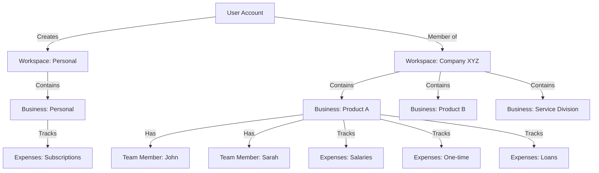
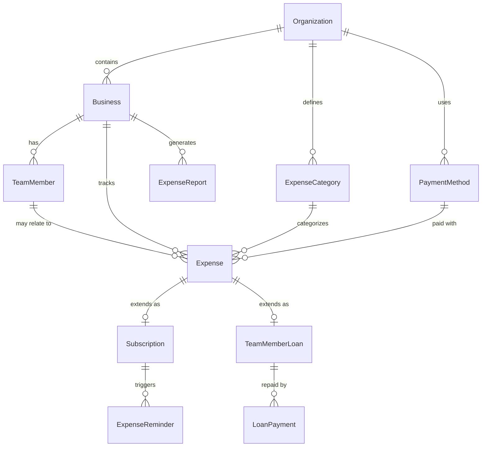

# Expense Tracking System Implementation Plan

## Architecture Overview

**Workspace Structure:**

- Each **Workspace** (Organization) can contain multiple **Businesses** (sub-businesses/products)
- **Personal Expense Tracking:** Users create a dedicated workspace with one business named "Personal"
- **Company Expense Tracking:** Workspaces for companies can have multiple businesses (e.g., Product A, Product B, Service Division)
- Workspace members have access to all businesses within that workspace
- **Team Members** (Employees) are separate entities from Workspace Members (users with system access)



## Phase 1: Database Schema Setup

### New Database Tables

Create SQL migration file: `packages/database/prisma/migrations/YYYYMMDDHHMMSS_expense_tracking_system/migration.sql`

**1. Business Table**

- Core entity representing a business/product within a workspace
- Fields: id, workspaceId, name, description, currency, type (personal/business), createdAt, updatedAt

**2. ExpenseCategory Table**

- Default categories: Subscription, Team Salary, One-time, Team Member Loan
- Admin can create custom categories (hybrid approach)
- Fields: id, workspaceId, name, type (default/custom), isActive, createdAt

**3. TeamMember Table**

- Employees within a business (NOT workspace members)
- Fields: id, businessId, name, email, position, joinedDate, salary, status (active/inactive), notes, createdAt, updatedAt

**4. Expense Table**

- Central expense tracking
- Fields: id, businessId, categoryId, teamMemberId (nullable), title, description, amount, currency, date, paymentMethod, receiptUrl, status, metadata (JSON), createdAt, updatedAt, createdBy

**5. Subscription Table**

- Extends expense for subscription-specific fields
- Fields: id, expenseId, renewalDate, renewalFrequency (monthly/yearly/custom), autoRenew, reminderDays, nextReminderDate, cancelationDate, provider, status (active/cancelled/paused)

**6. TeamMemberLoan Table**

- Tracks loans given to team members
- Fields: id, expenseId, teamMemberId, principalAmount, remainingAmount, loanDate, notes, status (active/paid/partial)

**7. LoanPayment Table**

- Tracks loan repayments (manual entries)
- Fields: id, loanId, amount, paymentDate, paymentMethod, notes, recordedBy, createdAt

**8. PaymentMethod Table**

- Track payment sources
- Fields: id, workspaceId, name, type (credit_card/debit_card/bank_account/cash/other), lastFourDigits, isDefault, createdAt

**9. ExpenseReport Table**

- Monthly generated reports
- Fields: id, workspaceId, businessId (nullable - null means all businesses), reportPeriodStart, reportPeriodEnd, totalExpenses, categoryBreakdown (JSON), reportData (JSON), generatedAt, emailSentAt

**10. ExpenseReminder Table**

- Track reminder history for subscriptions
- Fields: id, subscriptionId, reminderType, scheduledDate, sentDate, status, emailContent

### Schema Relationships



### Configuration Updates

**File: [`config/index.ts`](config/index.ts)**

- Add expense tracking configuration
- Default categories
- Reminder settings
- Report generation settings
- Currency options

## Phase 2: Backend API Development

### API Module Structure: `packages/api/modules/expenses/`

**Router Files:**

- `router.ts` - Main expense tracking router
- `businesses/router.ts` - Business management
- `team-members/router.ts` - Team member management
- `subscriptions/router.ts` - Subscription tracking
- `loans/router.ts` - Loan management
- `reports/router.ts` - Report generation
- `analytics/router.ts` - Analytics & insights

**Procedures (Business Management):**

- `businesses/procedures/create-business.ts`
- `businesses/procedures/update-business.ts`
- `businesses/procedures/delete-business.ts`
- `businesses/procedures/list-businesses.ts`
- `businesses/procedures/get-business-details.ts`

**Procedures (Expense Management):**

- `procedures/create-expense.ts`
- `procedures/update-expense.ts`
- `procedures/delete-expense.ts`
- `procedures/list-expenses.ts` (with filters: business, category, date range, payment method)
- `procedures/get-expense-details.ts`
- `procedures/bulk-import-expenses.ts` (CSV import)
- `procedures/upload-receipt.ts`

**Procedures (Team Members):**

- `team-members/procedures/create-team-member.ts`
- `team-members/procedures/update-team-member.ts`
- `team-members/procedures/delete-team-member.ts`
- `team-members/procedures/list-team-members.ts`
- `team-members/procedures/get-team-member-details.ts` (includes salary history, loans)

**Procedures (Subscriptions):**

- `subscriptions/procedures/create-subscription.ts`
- `subscriptions/procedures/update-subscription.ts`
- `subscriptions/procedures/cancel-subscription.ts`
- `subscriptions/procedures/list-subscriptions.ts` (filter: active/cancelled/upcoming renewal)
- `subscriptions/procedures/get-upcoming-renewals.ts`
- `subscriptions/procedures/update-reminder-settings.ts`

**Procedures (Loans):**

- `loans/procedures/create-loan.ts`
- `loans/procedures/add-loan-payment.ts`
- `loans/procedures/update-loan.ts`
- `loans/procedures/list-loans.ts` (filter: active/paid, by team member)
- `loans/procedures/get-loan-history.ts` (payments timeline)

**Procedures (Categories & Payment Methods):**

- `procedures/create-category.ts`
- `procedures/update-category.ts`
- `procedures/list-categories.ts`
- `procedures/create-payment-method.ts`
- `procedures/update-payment-method.ts`
- `procedures/list-payment-methods.ts`

**Procedures (Reports & Analytics):**

- `reports/procedures/generate-monthly-report.ts`
- `reports/procedures/list-reports.ts`
- `reports/procedures/get-report-details.ts`
- `reports/procedures/export-report-pdf.ts`
- `analytics/procedures/get-expense-overview.ts`
- `analytics/procedures/get-category-breakdown.ts`
- `analytics/procedures/get-trend-analysis.ts`
- `analytics/procedures/compare-businesses.ts`
- `analytics/procedures/get-team-member-expense-summary.ts`

### Cron Job API Endpoint

**File: `apps/web/app/api/cron/expense-reminders/route.ts`**

- Check subscriptions due for renewal (configurable reminder days)
- Send email reminders
- Log reminder history
- Schedule: Daily at 9 AM (configured in `vercel.json`)

**File: `apps/web/app/api/cron/generate-monthly-reports/route.ts`**

- Generate reports for all workspaces at period end
- Send email with report summary
- Schedule: Based on each workspace's billing period

**Update: `vercel.json`**

```json
{
  "crons": [
    {
      "path": "/api/cron/expense-reminders",
      "schedule": "0 9 * * *"
    },
    {
      "path": "/api/cron/generate-monthly-reports",
      "schedule": "0 2 * * *"
    }
  ]
}
```

## Phase 3: Email Templates

### New Email Templates: `packages/mail/emails/`

**Templates to Create:**

1. `SubscriptionRenewalReminder.tsx` - Upcoming subscription renewal
2. `SubscriptionCancellationReminder.tsx` - Reminder to cancel before renewal
3. `MonthlyExpenseReport.tsx` - Monthly report summary with charts
4. `LoanPaymentReceived.tsx` - Confirmation of loan payment recorded

**Implementation Pattern:**

Follow existing pattern from `OrganizationInvitation.tsx`:

- Use React Email components
- Support i18n translations
- Include workspace/business branding
- Clear call-to-action buttons

## Phase 4: Frontend - Routing & Navigation

### New Routes: `apps/web/app/(saas)/[organizationSlug]/`

**Business Management:**

- `expenses/page.tsx` - Expense tracking hub (dashboard)
- `expenses/businesses/page.tsx` - List all businesses
- `expenses/businesses/new/page.tsx` - Create new business
- `expenses/businesses/[businessId]/page.tsx` - Business overview
- `expenses/businesses/[businessId]/edit/page.tsx` - Edit business

**Expense Management:**

- `expenses/[businessId]/all/page.tsx` - All expenses for a business
- `expenses/[businessId]/new/page.tsx` - Create new expense
- `expenses/[businessId]/[expenseId]/page.tsx` - Expense details
- `expenses/[businessId]/[expenseId]/edit/page.tsx` - Edit expense

**Subscriptions:**

- `expenses/[businessId]/subscriptions/page.tsx` - All subscriptions
- `expenses/[businessId]/subscriptions/new/page.tsx` - Add subscription
- `expenses/[businessId]/subscriptions/[subscriptionId]/page.tsx` - Subscription details

**Team Members:**

- `expenses/[businessId]/team/page.tsx` - List team members
- `expenses/[businessId]/team/new/page.tsx` - Add team member
- `expenses/[businessId]/team/[memberId]/page.tsx` - Member details (salary history, loans)

**Loans:**

- `expenses/[businessId]/loans/page.tsx` - All loans
- `expenses/[businessId]/loans/[loanId]/page.tsx` - Loan details & payments

**Reports & Analytics:**

- `expenses/reports/page.tsx` - All reports
- `expenses/reports/[reportId]/page.tsx` - View report
- `expenses/analytics/page.tsx` - Analytics dashboard

### Navigation Updates

**File: [`apps/web/modules/saas/shared/components/AppSidebar.tsx`](apps/web/modules/saas/shared/components/AppSidebar.tsx)**

Add "Expenses" section to sidebar with:

- Dashboard (overview)
- Businesses
- All Expenses
- Subscriptions
- Team Members
- Loans
- Reports
- Analytics

## Phase 5: Frontend Components

### Shared Components: `apps/web/modules/saas/expenses/components/`

**Business Management:**

- `BusinessList.tsx` - Grid/list of businesses with stats
- `BusinessCard.tsx` - Individual business card with quick stats
- `CreateBusinessDialog.tsx` - Modal to create business
- `BusinessForm.tsx` - Reusable form for create/edit
- `BusinessSelector.tsx` - Dropdown to switch between businesses
- `DeleteBusinessDialog.tsx` - Confirmation dialog

**Expense Management:**

- `ExpenseList.tsx` - Filterable table of expenses
- `ExpenseCard.tsx` - Individual expense display
- `ExpenseForm.tsx` - Create/edit expense form
- `ExpenseFilters.tsx` - Filter by date, category, amount, payment method
- `ExpenseDetailsModal.tsx` - Quick view modal
- `ReceiptUpload.tsx` - Receipt image upload (similar to avatar upload)
- `BulkImportDialog.tsx` - CSV import interface

**Category Management:**

- `CategorySelector.tsx` - Dropdown with default + custom categories
- `ManageCategoriesDialog.tsx` - Admin interface to manage categories
- `CreateCategoryForm.tsx` - Form to create custom category

**Payment Methods:**

- `PaymentMethodSelector.tsx` - Dropdown to select payment method
- `PaymentMethodList.tsx` - List of payment methods
- `AddPaymentMethodDialog.tsx` - Add new payment method
- `PaymentMethodCard.tsx` - Display payment method with actions

**Team Members:**

- `TeamMemberList.tsx` - Table of team members
- `TeamMemberCard.tsx` - Member card with photo, position, salary
- `TeamMemberForm.tsx` - Create/edit member form
- `TeamMemberDetailsView.tsx` - Comprehensive view with tabs
- `SalaryHistoryTimeline.tsx` - Visual timeline of salary changes
- `DeleteTeamMemberDialog.tsx` - Confirmation dialog

**Subscriptions:**

- `SubscriptionList.tsx` - Table with renewal dates, status badges
- `SubscriptionCard.tsx` - Card showing subscription details
- `SubscriptionForm.tsx` - Create/edit subscription
- `RenewalCalendar.tsx` - Calendar view of upcoming renewals
- `SubscriptionStatusBadge.tsx` - Active/Cancelled/Paused badge
- `ReminderSettingsForm.tsx` - Configure reminder preferences
- `CancelSubscriptionDialog.tsx` - Cancellation confirmation

**Loans:**

- `LoanList.tsx` - Table of all loans
- `LoanCard.tsx` - Loan summary card
- `CreateLoanDialog.tsx` - Create new loan
- `LoanDetailsView.tsx` - Detailed loan view with payment history
- `AddLoanPaymentDialog.tsx` - Record payment
- `LoanPaymentHistory.tsx` - Timeline of payments
- `LoanProgressBar.tsx` - Visual progress of loan repayment

**Reports:**

- `ReportList.tsx` - List of generated reports
- `ReportCard.tsx` - Report summary card
- `ReportViewer.tsx` - Full report view with charts
- `GenerateReportDialog.tsx` - Manual report generation
- `ReportDownloadButton.tsx` - Export as PDF
- `ReportEmailHistory.tsx` - Show when reports were emailed

**Analytics:**

- `ExpenseOverviewCard.tsx` - Total expenses, trends
- `CategoryBreakdownChart.tsx` - Pie/donut chart of categories
- `MonthlyTrendChart.tsx` - Line chart of expenses over time
- `BusinessComparisonChart.tsx` - Compare businesses
- `TopExpensesWidget.tsx` - Highest expenses
- `UpcomingRenewalsWidget.tsx` - Next subscriptions due
- `ActiveLoansWidget.tsx` - Outstanding loans summary
- `QuickStatsGrid.tsx` - 4-card grid with key metrics

### Dashboard Components

**Main Dashboard: `ExpenseDashboard.tsx`**

- Overview of all businesses
- Quick stats (total expenses this month, upcoming renewals, active loans)
- Recent expenses
- Business selector
- Quick actions (Add expense, Add subscription, etc.)

**Business Dashboard: `BusinessDashboard.tsx`**

- Business-specific overview
- Month-to-date expenses
- Category breakdown
- Recent transactions
- Team member count
- Active subscriptions

## Phase 6: Data Visualization & Charts

**Library:** Use existing charting library or add Recharts/Chart.js

**Charts to Implement:**

- Pie/Donut Chart - Category breakdown
- Line Chart - Monthly expense trends
- Bar Chart - Business comparison
- Area Chart - Cumulative expenses
- Stacked Bar Chart - Category breakdown over time

## Phase 7: Permission & Access Control

**Workspace-level Permissions:**

- **Owner/Admin:** Full access to all businesses, can create/edit/delete everything
- **Member:** View-only access (configurable per workspace)

**Business-level Permissions (future enhancement):**

- Currently: Access follows workspace permissions
- Future: Granular per-business permissions

## Phase 8: Mobile Responsiveness

Ensure all components are mobile-first:

- Responsive tables (collapse to cards on mobile)
- Touch-friendly buttons and forms
- Mobile-optimized charts
- Drawer-based filters on mobile
- Bottom sheet for quick actions

## Phase 9: Testing & Optimization

**Manual Testing Checklist:**

- Create workspace with single "Personal" business
- Create workspace with multiple businesses
- Add expenses across all categories
- Create subscriptions with reminders
- Add team members and assign loans
- Record loan payments
- Generate monthly reports
- Test email reminders (use test environment)
- Test filters and search
- Test CSV import
- Test PDF export

**Performance Optimization:**

- Lazy load charts
- Paginate expense lists
- Index database queries
- Cache analytics data
- Optimize report generation

## Implementation Order

### Phase 1: Foundation (Week 1-2)

1. Database schema + SQL migration file
2. Prisma schema updates
3. Run migration: `pnpm --filter database migrate`
4. Generate Prisma client: `pnpm --filter database generate`
5. Config updates

### Phase 2: Business Management (Week 2-3)

1. Business API procedures
2. Business routing
3. Business components (list, create, edit, delete)
4. Business selector/switcher

### Phase 3: Basic Expense Tracking (Week 3-4)

1. Expense API procedures
2. Category & payment method APIs
3. Expense form components
4. Expense list with filters
5. Receipt upload

### Phase 4: Subscriptions (Week 4-5)

1. Subscription API procedures
2. Subscription components
3. Reminder settings
4. Email templates
5. Cron job for reminders

### Phase 5: Team Members & Loans (Week 5-6)

1. Team member API procedures
2. Loan API procedures
3. Team member components
4. Loan components
5. Payment tracking

### Phase 6: Analytics & Reports (Week 6-7)

1. Analytics API procedures
2. Report generation API
3. Dashboard components
4. Chart components
5. Report viewer
6. Monthly report cron job
7. Report email templates

### Phase 7: Polish & Testing (Week 7-8)

1. Mobile responsiveness
2. Loading states & error handling
3. Permissions enforcement
4. CSV import/export
5. PDF report generation
6. Testing & bug fixes

## Key Technical Decisions

**Currency Handling:**

- Single currency per workspace (stored in workspace settings)
- All expenses in that currency
- No conversion needed

**Date Handling:**

- Store all dates in UTC
- Display in workspace timezone
- Configurable billing period (stored in workspace metadata)

**File Storage:**

- Receipts stored in existing S3/Cloudflare R2 bucket
- New bucket: `receipts` (add to config)

**Reporting:**

- Reports generated as JSON (stored in database)
- PDF generated on-demand from JSON
- Email includes summary + link to full report

**Permission Model:**

- Use existing workspace member roles
- Extend with expense-specific permissions later if needed

## Files to Create/Modify Summary

**Database:**

- `packages/database/prisma/migrations/[timestamp]_expense_tracking_system/migration.sql` (NEW)

**Config:**

- `config/index.ts` (MODIFY - add expense config)
- `vercel.json` (MODIFY - add cron jobs)

**API Packages:**

- `packages/api/modules/expenses/**/*.ts` (NEW - ~50 files)

**Email Templates:**

- `packages/mail/emails/SubscriptionRenewalReminder.tsx` (NEW)
- `packages/mail/emails/SubscriptionCancellationReminder.tsx` (NEW)
- `packages/mail/emails/MonthlyExpenseReport.tsx` (NEW)
- `packages/mail/emails/LoanPaymentReceived.tsx` (NEW)

**Frontend Routes:**

- `apps/web/app/(saas)/[organizationSlug]/expenses/**/*.tsx` (NEW - ~20 route files)

**Frontend Components:**

- `apps/web/modules/saas/expenses/components/**/*.tsx` (NEW - ~60 components)

**Cron Jobs:**

- `apps/web/app/api/cron/expense-reminders/route.ts` (NEW)
- `apps/web/app/api/cron/generate-monthly-reports/route.ts` (NEW)

**Translations:**

- Update i18n files with expense tracking translations

## Success Criteria

- Users can create personal expense workspace with one business
- Users can create company workspace with multiple businesses
- All expense categories work (subscription, salary, one-time, loan)
- Team members can be managed independently of workspace members
- Subscriptions send email reminders before renewal
- Monthly reports generated and emailed automatically
- Analytics dashboard shows meaningful insights
- Mobile-responsive on all screens
- Receipt uploads work
- CSV import/export functional