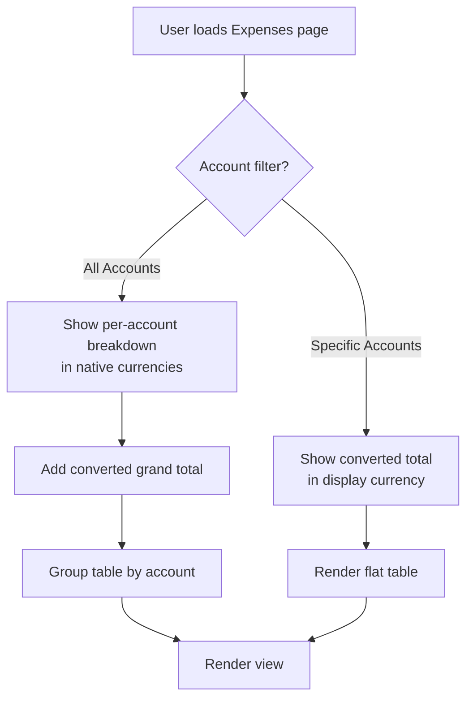
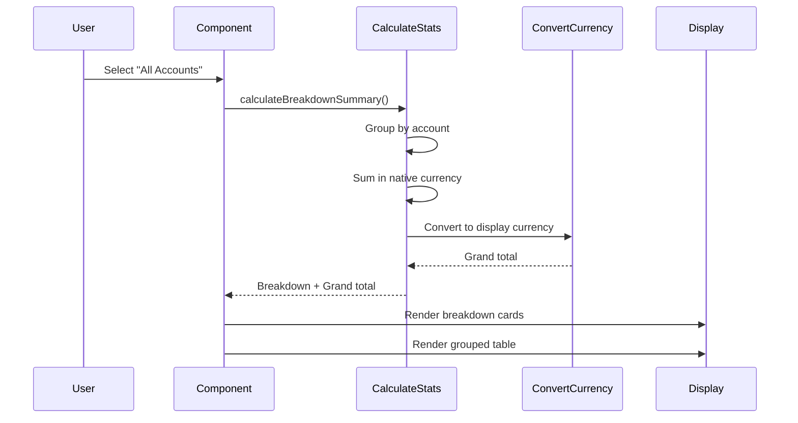

# Multi-Currency Display Enhancement Plan

## Overview

Enhance the Expenses, Team Members, Subscriptions, and Loans directories to properly handle multi-currency display with:

- Currency filter dropdown for viewing totals in selected currency
- Per-account breakdown when "All Accounts" is selected (native currencies)
- Grouped table view by expense account with subtotals
- Converted grand total below breakdown

## Implementation Strategy



## Phase 1: Expenses Directory Enhancement

### 1.1 Update Filter State and UI

**File:** [`apps/web/modules/saas/expenses/components/ConsolidatedExpensesDashboard.tsx`](apps/web/modules/saas/expenses/components/ConsolidatedExpensesDashboard.tsx)

Add `displayCurrency` to filter state:

```typescript
const [filters, setFilters] = useState({
    startDate: subDays(new Date(), 30) as Date | undefined,
    endDate: new Date() as Date | undefined,
    accountIds: [] as string[], // Empty = "All Accounts"
    status: undefined as string | undefined,
    search: "",
    displayCurrency: config.expenses.defaultBaseCurrency as string, // NEW
});
```

Add currency selector in the filters section (between Status and Search):

```typescript
<div className="space-y-2">
    <div className="text-sm font-medium">
        {t("expenses.filters.displayCurrency")}
    </div>
    <Select
        value={filters.displayCurrency}
        onValueChange={(value) => {
            setFilters((prev) => ({
                ...prev,
                displayCurrency: value,
            }));
        }}
    >
        <SelectTrigger>
            <SelectValue />
        </SelectTrigger>
        <SelectContent>
            {config.expenses.supportedCurrencies.map((currency) => (
                <SelectItem key={currency} value={currency}>
                    {currency}
                </SelectItem>
            ))}
        </SelectContent>
    </Select>
</div>
```

### 1.2 Create Summary Calculation Logic

Create new helper functions for multi-currency summaries:

**New File:** [`apps/web/modules/saas/expenses/lib/currency-summary.ts`](apps/web/modules/saas/expenses/lib/currency-summary.ts)

```typescript
export interface AccountBreakdown {
    accountId: string;
    accountName: string;
    currency: string;
    amount: number;
}

export interface SummaryStats {
    // For specific account selection
    last30Days: number;
    currentMonth: number;
    totalCount: number;
    
    // For "All Accounts" breakdown
    last30DaysBreakdown?: AccountBreakdown[];
    currentMonthBreakdown?: AccountBreakdown[];
    grandTotalLast30Days?: number; // Converted to display currency
    grandTotalCurrentMonth?: number; // Converted to display currency
}

export function calculateSummaryStats(
    expenses: Expense[],
    accounts: ExpenseAccount[],
    selectedAccountIds: string[],
    displayCurrency: string,
    currencyRates: CurrencyRate[]
): SummaryStats {
    const isAllAccounts = selectedAccountIds.length === 0;
    
    if (isAllAccounts) {
        // Calculate per-account breakdown in native currencies
        return calculateBreakdownSummary(expenses, accounts, displayCurrency, currencyRates);
    } else {
        // Calculate converted totals for selected accounts
        return calculateConvertedSummary(expenses, displayCurrency, currencyRates);
    }
}
```

### 1.3 Update Summary Cards Component

Replace the current summary calculation (lines 92-128) with the new logic:

```typescript
const summaryStats = useMemo(() => {
    return calculateSummaryStats(
        expensesData?.expenses || [],
        expenseAccounts || [],
        filters.accountIds,
        filters.displayCurrency,
        currencyRates || []
    );
}, [expensesData, expenseAccounts, filters.accountIds, filters.displayCurrency, currencyRates]);

const isAllAccountsView = filters.accountIds.length === 0;
```

Update summary cards to conditionally render breakdown or single total:

```typescript
<Card className="p-6">
    <div className="flex items-center justify-between">
        <div className="w-full">
            <p className="text-muted-foreground text-sm">
                {t("expenses.consolidated.last30Days")}
            </p>
            {isAllAccountsView && summaryStats.last30DaysBreakdown ? (
                <div className="space-y-2 mt-2">
                    {summaryStats.last30DaysBreakdown.map((breakdown) => (
                        <div key={breakdown.accountId} className="flex justify-between items-center">
                            <span className="text-sm font-medium">{breakdown.accountName}</span>
                            <span className="text-lg font-bold">
                                {formatCurrency(
                                    breakdown.amount,
                                    breakdown.currency,
                                    currencyRates?.find(r => r.toCurrency === breakdown.currency)
                                )}
                            </span>
                        </div>
                    ))}
                    <div className="border-t pt-2 flex justify-between items-center">
                        <span className="text-sm text-muted-foreground">
                            {t("expenses.consolidated.total")} ({filters.displayCurrency})
                        </span>
                        <span className="text-xl font-bold">
                            {formatCurrency(
                                summaryStats.grandTotalLast30Days || 0,
                                filters.displayCurrency,
                                currencyRates?.find(r => r.toCurrency === filters.displayCurrency)
                            )}
                        </span>
                    </div>
                </div>
            ) : (
                <p className="text-2xl font-bold">
                    {formatCurrency(
                        summaryStats.last30Days,
                        filters.displayCurrency,
                        currencyRates?.find(r => r.toCurrency === filters.displayCurrency)
                    )}
                </p>
            )}
        </div>
        <CalendarIcon className="text-muted-foreground size-8 ml-4" />
    </div>
</Card>
```

### 1.4 Group Table by Account

Transform the table to group expenses by account when "All Accounts" is selected:

```typescript
// Group expenses by account
const groupedExpenses = useMemo(() => {
    if (!isAllAccountsView || !expensesData?.expenses) {
        return null;
    }
    
    const groups = new Map<string, typeof expensesData.expenses>();
    
    for (const expense of expensesData.expenses) {
        const accountId = expense.businessId;
        if (!groups.has(accountId)) {
            groups.set(accountId, []);
        }
        groups.get(accountId)!.push(expense);
    }
    
    return groups;
}, [expensesData, isAllAccountsView]);

// Render grouped table
{groupedExpenses ? (
    Array.from(groupedExpenses.entries()).map(([accountId, accountExpenses]) => {
        const account = expenseAccounts?.find(a => a.id === accountId);
        const subtotal = accountExpenses.reduce((sum, e) => sum + Number(e.amount), 0);
        
        return (
            <Fragment key={accountId}>
                <TableRow className="bg-muted/50">
                    <TableCell colSpan={7} className="font-semibold">
                        {account?.name || "Unknown Account"} - {account?.currency}
                    </TableCell>
                </TableRow>
                {accountExpenses.map((expense) => (
                    <TableRow key={expense.id}>
                        {/* Existing expense row rendering */}
                    </TableRow>
                ))}
                <TableRow className="border-b-2">
                    <TableCell colSpan={2} className="text-right font-medium">
                        Subtotal:
                    </TableCell>
                    <TableCell className="font-bold">
                        {formatCurrency(subtotal, account?.currency || "USD", ...)}
                    </TableCell>
                    <TableCell colSpan={4}></TableCell>
                </TableRow>
            </Fragment>
        );
    })
) : (
    // Existing flat table rendering
)}
```

## Phase 2: Team Members Directory

Apply similar pattern to team members with salary-specific considerations.

**File:** [`apps/web/modules/saas/team-members/components/TeamMembersList.tsx`](apps/web/modules/saas/team-members/components/TeamMembersList.tsx) (or similar)

Key differences:

- Breakdown shows total salaries per account
- Consider salary frequency (monthly/annual)
- Group members by their primary account

## Phase 3: Subscriptions Directory

**File:** [`apps/web/modules/saas/subscriptions/components/SubscriptionsList.tsx`](apps/web/modules/saas/subscriptions/components/SubscriptionsList.tsx) (or similar)

Key differences:

- Show recurring costs per billing period
- Breakdown shows monthly/yearly costs per account
- Consider billing intervals in calculations

## Phase 4: Loans Directory

**File:** [`apps/web/modules/saas/loans/components/LoansList.tsx`](apps/web/modules/saas/loans/components/LoansList.tsx) (or similar)

Key differences:

- Show outstanding balances per account
- Breakdown shows total loaned vs. paid back
- Consider loan status (active/paid/cancelled)

## Phase 5: Translations

**File:** [`apps/web/locales/en.json`](apps/web/locales/en.json)

Add new translation keys:

```json
{
    "expenses": {
        "filters": {
            "displayCurrency": "Display Currency"
        },
        "consolidated": {
            "total": "Total",
            "accountBreakdown": "Breakdown by Account"
        }
    }
}
```

## Technical Considerations

### Currency Conversion Logic

Leverage existing conversion infrastructure in [`packages/utils/currency.ts`](packages/utils/currency.ts):

- `convertCurrency()` for cross-currency calculations
- Always use stored `baseCurrencyAmount` for accuracy
- Handle missing rates gracefully with warnings

### Performance Optimizations

- Memoize expensive calculations with `useMemo`
- Group operations to avoid multiple iterations
- Consider pagination impact on subtotals

### Data Flow



### Edge Cases to Handle

1. **No expenses:** Show empty state with currency selector
2. **Missing conversion rates:** Show warning badge, display in native currency only
3. **Single account selected:** Show as converted total (not breakdown)
4. **Deleted accounts:** Handle gracefully in breakdowns
5. **Very long account names:** Truncate with tooltip in breakdown view

## Testing Checklist

- [ ] Currency filter changes update summaries correctly
- [ ] "All Accounts" shows breakdown in native currencies
- [ ] Grand total converts accurately
- [ ] Table groups correctly by account
- [ ] Subtotals match per-account amounts
- [ ] Switching between "All" and specific accounts works smoothly
- [ ] Pagination preserves grouping
- [ ] Empty states display correctly
- [ ] Missing rate warnings show appropriately
- [ ] Performance acceptable with 100+ expenses across 5+ accounts